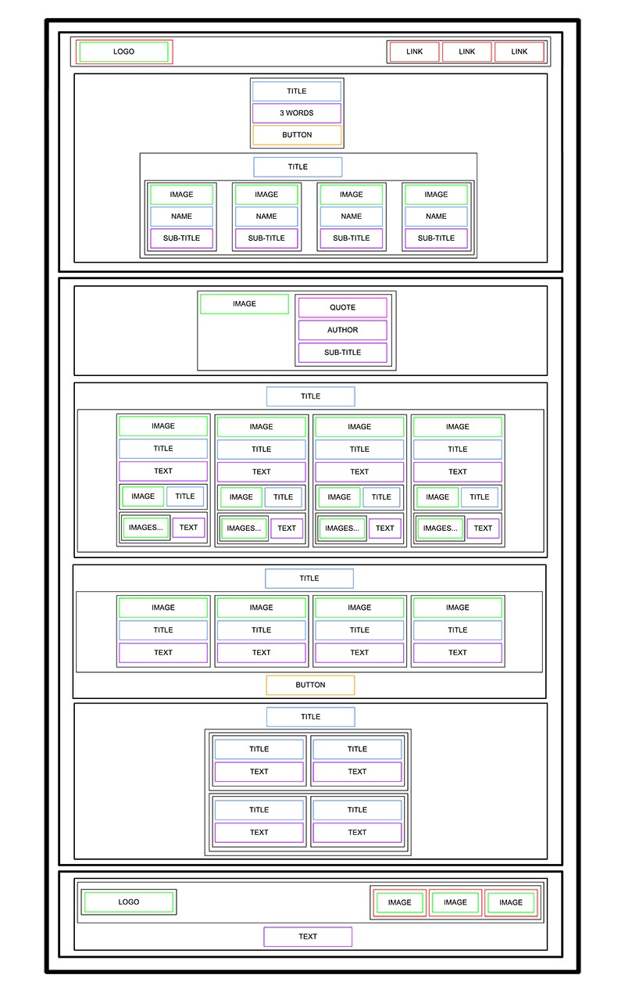

# HTML Advanced

## Learning Objectives
At the completion of this project, I am confident in my ability to explain the following concepts without external assistance:

* What is HTML: The core language for structuring content on the web.
* How to create an HTML page from a wireframe: The process of translating a visual layout into semantic HTML.
* What is a markup language: A system for annotating a document in a way that is syntactically distinguishable from text.
* What is the DOM (Document Object Model): A programming interface for HTML and XML documents, representing the page's structure and allowing programs to change document structure, style, and content.
* What is an element / tag: The building blocks of HTML, with tags defining elements and their content.
* What is an attribute: Properties that provide additional information about HTML elements.
* The purpose of each HTML tag used: Understanding the semantic meaning and function of specific HTML tags.
  

## In this part, I had to focus on the HTML structures - no CSS, no style, no JavaScript. Just using pure and semantic HTML to create the skeleton of the site based on a design file provided in Figma. 

### Project Structure
The project is organized with the following main sections, each created using appropriate HTML elements:

* Header: Contains introductory content, potentially including navigation or branding.
* Banner: A prominent section often used for key messages or imagery.
* Quote: Displays a notable quotation.
* Membership: Details about membership options or benefits.
* FAQ (Frequently Asked Questions): Addresses common questions.
* Footer: Contains copyright information, links, or contact details.

