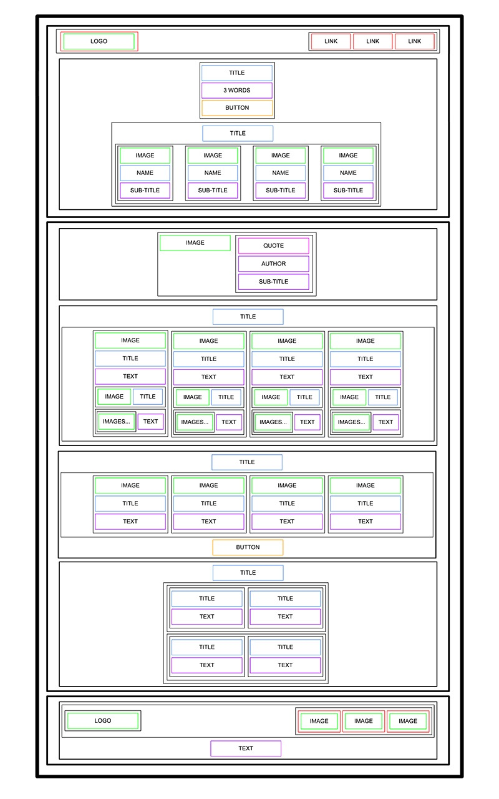

# HTML Advanced

For this project, I will focus on these concepts: 
* Some pointers about HTML
* HTML - elements of a web page
* HTML Foundations
* HTML - Semantic sectioning elements
* HTML Semantic Elements
* HTML Validation

### In this part, I had to focus on the HTML structures - no CSS, no style, no JavaScript. Just using pure and semantic HTML to create the skeleton of the site based on a design file provided in Figma. 

